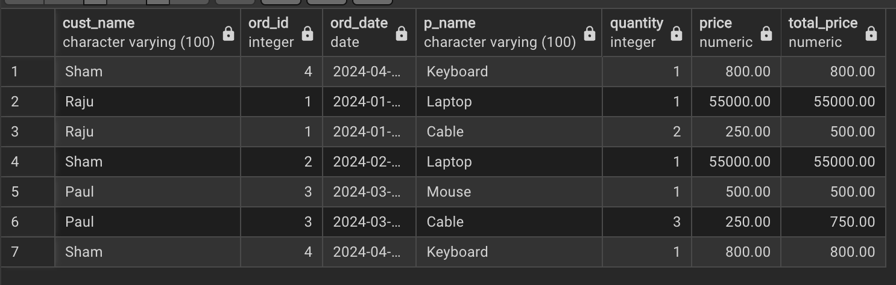

# StoreDB Project

A simple PostgreSQL practice project demonstrating database design, data insertion, and query operations for a small store/order system.

## Database Structure

The project contains 4 main tables:

1. **customers**: Stores customer information
   - Columns: `cust_id` (PK), `cust_name`
2. **orders**: Stores order information
   - Columns: `ord_id` (PK), `ord_date`, `cust_id` (FK to customers)
3. **products**: Stores products available
   - Columns: `p_id` (PK), `p_name`, `price`
4. **ord_items**: Stores items in each order
   - Columns: `items_id` (PK), `ord_id` (FK to orders), `p_id` (FK to products), `quantity`

**Relationships:**
- `orders.cust_id` → `customers.cust_id`
- `ord_items.ord_id` → `orders.ord_id`
- `ord_items.p_id` → `products.p_id`

## Getting Started

Follow these steps to set up and run the StoreDB project locally.

### 1️⃣ Install PostgreSQL
- Download and install PostgreSQL from the [official website](https://www.postgresql.org/download/).
- Default installation comes with `psql` CLI.
- Note the **PostgreSQL port** (default here: `5433`) and **superuser** (default here: `postgres`).

### 2️⃣ Create a new database
Open your terminal or psql shell and run:
```bash
createdb -U postgres -p 5433 storedb_project
```

### 3️⃣ Load the schema (tables & sequences)

Run the schema dump to create tables, sequences, and constraints:

```bash
psql -U postgres -p 5433 -d storedb_project -f schema.sql
````

### 4️⃣ Load seed data (sample data)

Run the seed file to populate the tables with sample data:

```bash
psql -U postgres -p 5433 -d storedb_project -f seed.sql
```

### 5️⃣ Run example queries

Run `queries.sql` to execute predefined queries:

```bash
psql -U postgres -p 5433 -d storedb_project -f queries.sql
```

### 6️⃣ Optional: Interactive testing

You can also enter the psql interactive shell to test queries manually:

```bash
psql -U postgres -p 5433 -d storedb_project
```
### Notes

- Ensure PostgreSQL server is running before executing any commands.
- If you are using a different port or user, replace `-p 5433` and `-U postgres` accordingly.
- Always load `schema.sql` **before** `seed.sql` to avoid errors.
- `queries.sql` is optional but demonstrates practical SQL usage and examples.
- You can use the psql interactive shell to run your own queries or test modifications.

## Example Output

Query: Show all orders with customer and product details

```sql
SELECT c.cust_name, o.ord_id, o.ord_date, p.p_name, oi.quantity, p.price, p.price*oi.quantity AS total_price
FROM ord_items oi
JOIN orders o ON oi.ord_id = o.ord_id
JOIN products p ON oi.p_id = p.p_id
JOIN customers c ON o.cust_id = c.cust_id;
```


## Tech Stack / Tools

```markdown
## Tech Stack

- PostgreSQL 14/18 (Official Installer)
- psql CLI
- SQL (DDL + DML + JOINs + Aggregates)

## Skills Demonstrated

- Database schema design (tables, sequences, relationships, constraints)
- Data insertion (sample data using SQL)
- Writing queries:
  - SELECT, WHERE, ORDER BY
  - Aggregations: SUM, COUNT, AVG
  - JOINs across multiple tables
  - Advanced queries (total spent, most expensive product, customers with multiple orders)
- PostgreSQL CLI and pg_dump usage
